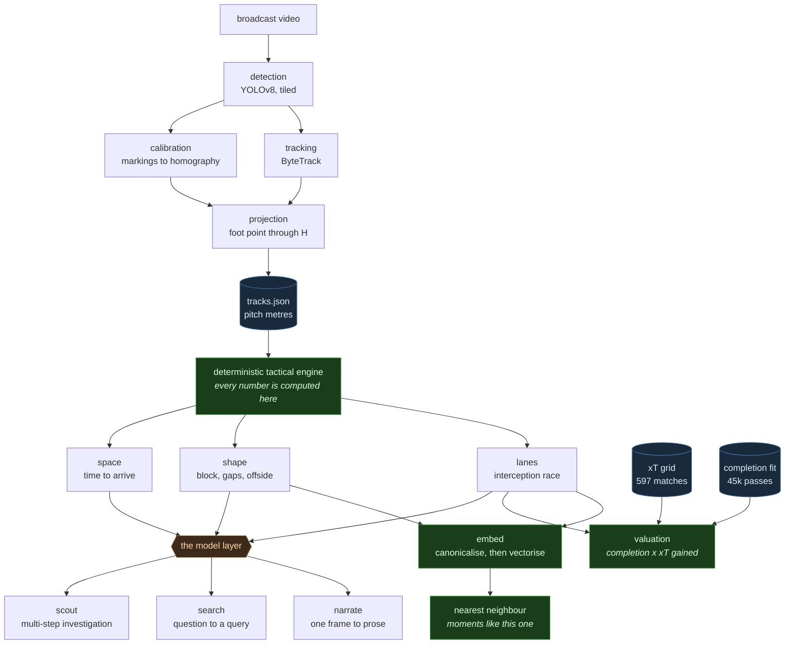
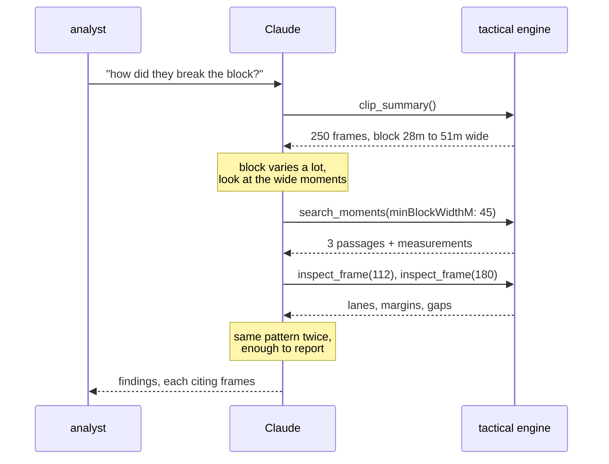

# FootballVisual

Turn broadcast football video into an interactive top-down tactical map, then ask it questions.

The pipeline detects and tracks all the players and the ball, recovers the camera's
pitch-to-image homography, and projects everything onto a flat 2D pitch in metres. The
sandbox plays that back beside the source video. Pause it and the map locks: drag players
to pose a different shape, draw movement arrows, and the tactical analysis recomputes
instantly, including the answer to the question this project was built around, *where is
the open passing lane?*



**The line through the middle is the whole design.** Everything above the engine is
measurement. Everything below it is language. The three model-facing surfaces differ only
in how much autonomy they get, and none of them is allowed to compute a number:

| Surface | The model's job | What it cannot do |
|---|---|---|
| `analyse` | Turn computed facts into a coach's sentence | See a coordinate, or pick which lane is open |
| `search` | Turn a question into a threshold query | Decide whether a frame matches |
| `scout` | Choose what to investigate, and in what order | Measure anything; every tool calls the engine |

Similarity retrieval and valuation both sit on the measurement side of that line entirely,
with no model in either. Retrieval answers with a shape rather than a sentence, and a shape
can be compared arithmetically. Valuation answers with a probability, and that probability
was counted off real matches rather than reasoned about.

## Quick start

```bash
make demo     # render the clip, run the pipeline, score it against ground truth
make web      # open http://localhost:3000
```

`make demo` takes about three minutes on CPU. No GPU required, no API key required.

## What each layer does

### 1. Detection (`pipeline/footballvisual/detect.py`)

YOLOv8 for players, run tiled: the frame is cut into overlapping crops so a player who
is 30 pixels tall in the full frame is effectively 50 by the time the network sees them.
On this project's clip that lifts recall from 0.86 to 0.90 at the same threshold.

The ball gets its own detector. A generic object detector finds essentially zero
footballs at broadcast framing, because the ball is a handful of pixels, motion-blurred
whenever it matters, and shaped like every other bright blob on the pitch. So it is
found classically instead, by the three properties that only hold together for a ball:
small but not a single pixel, close to circular, and not inside a player's box.

### 2. Tracking (`pipeline/footballvisual/track.py`)

ByteTrack, implemented from scratch: a constant-velocity Kalman filter over
(centre, aspect, height), Hungarian assignment on IoU, and the two-stage association
that gives ByteTrack its name. The low-confidence detections everyone throws away are
mostly real players who happen to be occluded, and recovering them is what keeps
identities stable through the crossings where a tracker would otherwise switch.

### 3. Homography (`pipeline/footballvisual/homography.py`, `calibrate.py`)

A football pitch is flat, so the map from pitch to image is a plane-to-plane projective
transform: an eight degree-of-freedom matrix. That is the whole reason this works
without recovering 3D camera pose. Estimated by normalised DLT inside RANSAC, written in
plain numpy so the maths is inspectable and testable.

Staying calibrated is the harder half. The camera pans, so a homography fitted on frame
zero is wrong by frame thirty. Sparse features are tracked on the grass between
consecutive frames, with players masked out, and the inter-frame homography they imply is
composed onto the running estimate.

Player positions are taken from the **bottom-centre** of each box, not the centre. The
homography maps the ground plane, and a player's centre floats a metre above it, which on
a shallow broadcast angle throws the position several metres up the pitch.

### 4. Team assignment (`pipeline/footballvisual/teams.py`)

Unsupervised, so it works on any fixture rather than only pre-configured ones. Shirt
colour is sampled from the torso (a bounding box is mostly grass), green pixels are
dropped before averaging, colours are compared in Lab, and each track votes over its
whole lifetime rather than per frame.

### 5. Tactical engine (`web/src/lib/tactics/`)

Deterministic, and the reason the analysis can be trusted.

The interesting piece is the **passing lane solver**. The obvious approach is to measure
how close the nearest defender is to the line between passer and receiver, and it is
wrong in both directions. A defender two metres off a 40 metre pass has all the time in
the world to step across it. A defender half a metre off a 6 metre pass cannot get a foot
to it before it arrives.

What actually decides a pass is a race, so that is what is modelled. For every point
along the lane, when does the ball get there, and when could the defender:

```
margin = min over the path of [ t_defender(s) − t_ball(s) ]
```

A positive margin is how many seconds the ball wins by. Defender momentum is included,
because a defender already sprinting the wrong way cannot simply stop. Two tests in
`lanes.test.ts` pin cases where distance and the interception race give *opposite*
answers, and the race is right.

Also computed: convex-hull team shape, block width and depth, the largest gap in the
defensive line, the offside line, who is between the lines, and a pitch-control field
from time-to-arrive (a soft logistic rather than a hard Voronoi, which would draw a crisp
border between two players a tenth of a second apart).

### 6. Clip retrieval (`web/src/lib/tactics/search.ts`, `api/search/route.ts`)

Ask the clip a question and jump to the moments that answer it: *"a big gap in the last
line"*, *"players between the lines with an open lane"*.

The invariant holds here too, applied to search instead of narration. Claude's entire
output is a structured `TacticalQuery` against a fixed schema of thresholds, and the search
itself runs in code over measurements the engine already computed. The model picks filters;
it never decides whether a frame qualifies.

That is what makes a result worth showing a coach. Every returned passage provably has the
property asked for, the same question always returns the same passages, and each hit shows
the numbers that qualified it. A model picking moments directly offers none of those.

Consecutive matches collapse into passages, with short gaps bridged, because at 25fps a two
second moment is fifty near-identical hits and a player lost for two frames is detection
flicker rather than a new moment. With no API key a heuristic parser handles the common
phrasings, and the response says which path produced the query.

### 7. Valuation (`web/src/lib/tactics/xt.ts`, `value.ts`)

The engine could say a lane was open. It could not say whether the pass was
*worth playing*, because nothing in it knew that a metre gained at the edge of
the box is worth more than a metre gained in your own half. `progressionM`
counted both the same, and a safe square ball scored well on every geometric
measure while achieving nothing.

Two models fix that, and neither is invented here.

**Reward** is Expected Threat, in Karun Singh's formulation. Each pitch cell is
worth the probability a possession there ends in a goal, which satisfies

```
xT(z) = s(z)·g(z) + m(z)·Σ T(z→z')·xT(z')
```

a team either shoots from `z` or moves the ball and inherits the value of
wherever it lands. Value flows backwards from the goal through the passes that
reach it, so the model works out that the half spaces beat the touchline without
being told. Trained by `pipeline/train_xt.py` on **597 matches and 1.05M actions**
of StatsBomb open data, and committed as JSON so nothing at runtime needs the
network. Counts are folded about the halfway line's long axis before solving,
because the left and right wings are the same place and folding halves the
variance.

One trap worth recording: the recursion converges at the rate of the move share,
and away from the box barely one action in a hundred is a shot, so that rate is
about 0.99. Twelve iterations looks converged and leaves the build-up third still
climbing, which understates exactly the part of the pitch this project's clip is
played in. It now runs to a tolerance, and `test_a_dozen_iterations_is_not_enough`
pins the mistake.

**Risk** is pass completion, and it is *fitted rather than assumed*. The
tempting move is to run the interception margin through a logistic with
hand-chosen constants, which would be an invented number wearing the costume of
a measured one. Instead `pipeline/train_completion.py` runs the identical
interception race over StatsBomb 360 freeze frames, which record every visible
player at the moment of each pass, and fits the curve to **45,530 real passes**
whose outcomes are known, held out by match against **16,575** more.

That fit is also the first end-to-end validation this project has of its own
core model. The interception race was argued for from first principles and
pinned by hand-built unit tests; it had never been checked against real
football. It holds:

| margin (s) | passes | observed | predicted |
|---|---|---|---|
| −1.50 to −0.75 | 2,096 | 0.416 | 0.348 |
| −0.40 to −0.20 | 2,415 | 0.714 | 0.709 |
| −0.05 to +0.10 | 4,854 | 0.801 | 0.831 |
| +0.30 to +0.60 | 13,212 | 0.971 | 0.940 |
| +1.00 to +2.00 | 1,324 | 0.996 | 0.995 |

Completion rises monotonically from 42% to 99.6% across the margin range, so the
race genuinely measures what it claims to. Holdout Brier skill is 0.166 against
the base rate. Pass length was admitted as a second feature only because it
improved holdout skill (0.166 against 0.148); the choice is made in code against
held-out matches, not by taste.

Length behaves in a way worth writing down, because it looks like a bug and is
not. Unconditionally, longer passes complete far less often, 0.91 between 10m and
20m against 0.40 beyond 45m. Hold the interception margin fixed and the sign
flips, in every band measured:

| margin (s) | short (0-12m) | long (25-60m) |
|---|---|---|
| −0.4 to 0.1 | 0.680 | 0.800 |
| 0.1 to 0.3 | 0.789 | 0.913 |
| 0.3 to 0.7 | 0.964 | 0.974 |

The margin means different things at the two lengths. A six metre pass that only
just wins the race has a defender on top of it in a tight area; a forty metre
pass with the same margin is travelling through open space. Length is already
priced into the margin, so what is left is a statement about the space around
the ball. Worth noting that the freeze frame's camera truncation biases *against*
this effect rather than producing it: a long pass whose target area was off
camera gets an overstated margin, which would make long passes complete less
often than predicted, not more.

The linear term is a summary, not the truth: the real curve turns over at the
longest range, where 25-60m at a comfortable margin drops slightly below 12-25m.
A monotone term cannot represent that, which is a known and bounded limitation
rather than a hidden one.

Put together, a pass is worth `completion × xT(target) − xT(origin)`. Negative is
a real and common answer: a safe square ball keeps the ball and gives up the
position it started from. The one deliberate simplification is that a turnover is
valued at zero for the passing team rather than negative, because pricing the
opponent's counter would need a second model and a constant nobody here has
measured.

On the demo clip the valuation disagrees with the geometry, which is the reason
it exists. At frame 140:

| lane | verdict | margin | gains | value |
|---|---|---|---|---|
| → #20 | contested | 0.26s | +10m | **+0.0019 xT** |
| → #37 | open | 0.64s | −10m | +0.0001 xT |
| → #5 | open | 0.52s | −10m | −0.0004 xT |

Two lanes are comfortably open and one is contested, and the contested one is the
only pass worth playing. The open pair go backwards, so they buy safety with
position. No arrangement of the old geometric weights says that, because none of
them knew what the ground was worth.

`offBallThreat` applies the same grid to where every attacker is *standing*,
which is the valuation that is not about the ball at all. A player in dangerous
space with no lane to them is a different coaching problem to one with an open
lane and nowhere to go, and only the off-ball view separates the two.

### 8. Similarity retrieval (`web/src/lib/tactics/embedding.ts`)

Threshold search answers a question you already know how to ask. An analyst watching a
clip usually has the opposite problem: there is a shape on screen, it obviously matters,
and naming the three numbers that would find it again is the hard part. So each frame
maps to a vector, and *"moments like this one"* becomes nearest neighbour.

The step that makes it work is **canonicalisation**, and it is geometric rather than
learned. The same situation played toward the other goal, or down the other wing, is the
same situation, and raw coordinates say otherwise: a build-up on the left at one end and
its mirror at the other end share almost no numbers. Two reflections fix it, x so the team
in possession always attacks toward +x, and y so the ball is always in the +y half.
Reflection is an isometry, so it cannot distort the shape it is about to measure, only
relabel where that shape sits. `embedding.test.ts` pins both directions: mirrored ends and
mirrored wings each embed above 0.97 similarity, while a stretched block falls below it.

The vector itself is handcrafted, a coarse occupancy grid per team plus the tactical
scalars the engine already computed, and that is a deliberate limit rather than a
placeholder. A learned representation needs thousands of match hours; ten matches of open
tracking data cannot produce one. Everything around the representation is the real thing,
and swapping in a learned vector later changes `embedFrame` and nothing else.

Results are spaced at least 25 frames apart. The true nearest neighbours of frame 120 are
frames 119 and 121, which are the same moment and tell an analyst nothing.

### 9. The scout (`web/src/app/api/scout/route.ts`)

`analyse` handles one frame and `search` handles one query. Neither can answer *"how did
they create their chances?"*, because that takes several searches, a look at what each
returned, and a decision about what to look at next. That is an agent loop, so it is one.



**The model never measures anything.** Every tool is a call into the engine, so it chooses
*which* questions to ask and in what order while the numbers stay computed. The response
carries the full tool transcript, so any finding can be traced to the measurement behind it
rather than taken on trust.

Two deliberate constraints: tools are withheld on the final turn, so the loop cannot end
with the model asking for a search it will never get, and there is **no deterministic
fallback**. The other two routes degrade gracefully because their work is phrasing and
pattern matching. Deciding what to investigate next based on what the last search returned
is the part a model actually does, and a canned sequence of searches pretending to be an
investigation would be worse than saying plainly that this one needs a key.

### 10. The analyst (`web/src/app/api/analyse/route.ts`)

Every tactical *fact* is computed before the model is involved. Claude receives the
numbers and turns them into the sentence a coach would say. It never sees raw
coordinates, so it cannot redo the geometry and reach a different answer to the one drawn
on screen, and it is never asked which lane is open.

That constraint is what makes the analysis reproducible, and it is why the deterministic
fallback is not a stub: with no `ANTHROPIC_API_KEY` set, the same facts go through a
rule-based writer and the answer is still specific and true, just less fluent. The UI
labels which path produced each answer.

Set `ANTHROPIC_API_KEY` in `web/.env.local` to enable the model.

## Accuracy

The synthetic clip knows where every player really was, so the pipeline can be scored
rather than demoed. `make demo` prints this:

```
position MAE          0.78 m
position p95          1.76 m
detection coverage    74.6%   (21 of 21 players matched by some track)
identity switches     8
team assignment       100.0%
ball coverage         100.0%
ball MAE              1.85 m
```

How to read these:

- **Position MAE 0.78 m** bounds everything above it. A passing-lane margin that turns on
  distances finer than about a metre is noise, which is why the verdict thresholds are set
  in *seconds* rather than centimetres.
- **Coverage 74.6%** counts frames, not players. Every one of the 21 on-screen players is
  followed by a track; the shortfall is frames where a player is missed and their track is
  coasting on prediction. For what that number is worth against a commercial system, see
  [Comparison to professional tracking](#comparison-to-professional-tracking).
- **8 identity switches** over 250 frames. Each one corrupts a trajectory from that point
  on, so this is the number to watch when tuning.
- **Ball MAE 1.85 m** is still the weakest number here, and it took three attempts to
  find out why, which is worth recording because two of them were wrong.

  Smoothing was not the cause: widening the window from 1 to 21 frames moved the error by
  0.01 m, so it was not random jitter. Ball height was not the cause either: in flight
  versus on the ground was 3.26 m against 2.96 m. What finally showed it was looking at
  the distribution instead of the mean. It was bimodal, a 1.8 m median and a 5.1 m 90th
  percentile, then a jump to 15.6 m at the 95th. About one frame in ten had locked onto
  the wrong white blob entirely.

  The cause was the motion gate, which allowed the ball to jump 220 pixels between
  frames when a driven pass moves it about 0.64 m, a few tens of pixels at this scale.
  Tightening it and scaling it with time-since-last-seen took ball error from 3.11 m down
  toward the current 1.85 m, with coverage at 100%.

Calibrating from the markings rather than from clicked landmarks is what moved position
MAE from 1.29 m down toward 0.78 m. That is not surprising in hindsight: the landmark path
simulates a human clicking with two pixels of error, and a line fit over hundreds of pixels
of evidence beats that. Run `make track-manual` to reproduce the clicked-landmark numbers.

Run `make evaluate` to re-score an existing `tracks.json`.

## Comparison to professional tracking

Those numbers are measured on this project's own synthetic clip, which makes them honest
but not comparable. "74.6% coverage" tells you nothing on its own, because there is no way
to know whether the missing quarter is a defect here or simply what broadcast footage
gives you.

[SkillCorner and PySport](https://github.com/SkillCorner/opendata) publish ten matches of
broadcast tracking data from a commercial system that clubs actually buy. Every player
carries an `is_detected` flag separating the frames where they were genuinely seen from
the frames where the position was extrapolated, and that flag is the benchmark.

```bash
make skillcorner    # one match, ~86 MB, CC licensed by SkillCorner
make benchmark
```

Over 40,404 frames of one match, that commercial system:

| | Reference (commercial) |
|---|---|
| Players reported per frame | 22, always |
| Players **actually detected** per frame | **13** (mean 11.3) |
| Detection rate | **51.2%** mean, 59.1% median |
| Ball **actually seen** | **78.9%** of frames |

Two things follow, and both are about this project's *real footage* results rather than
its synthetic ones.

First, recovering roughly half to two thirds of the squad from a broadcast frame is what
the state of the art does. The tighter of the two Premier League clips tested here tracked
a median of 12 players against roughly 20 visible, which
[docs/REAL_FOOTAGE.md](docs/REAL_FOOTAGE.md) wrote up as a shortfall and which is in fact
squarely in the commercial range.

Second, it confirms the ball problem from the other direction. A professional system sees
the ball in four frames out of five. This pipeline reporting 100% on real clips was never
going to be real, and separately turned out not to be.

This is context, not a score, and the tool says so twice in its own output. The reference
is a different match on footage this repository does not have, so there is no head to head
here, only a range.

## The clip, and why it is synthetic

The pipeline works on any video. The one in the repo is generated, and that is a
deliberate choice rather than a shortcut.

A licensed broadcast clip cannot ship in an open repo, and an unlabelled clip could not
be *scored* anyway. So `synth.py` composites **real segmented photographs of people**
onto a perspective-projected pitch, driven by a real pinhole camera whose ground-plane
homography is exact by construction. YOLO therefore runs on genuine photographic texture,
while every player's true pitch coordinate stays known.

It is hard in the ways that matter here (perspective, scale with depth, mutual occlusion,
a moving camera, jersey colours to cluster) and easy in ways it does not model (no
shadows, no crowd, no broadcast graphics, no camera cuts). It is a measurable test
harness, not a claim of photorealism.

To run on real footage, see **[docs/REAL_FOOTAGE.md](docs/REAL_FOOTAGE.md)**. It says what
a useful clip looks like, what is likely to break first (team clustering, if the two kits
are not visually distinct), and how to fall back to clicked landmarks if automatic
calibration cannot get a confident fit.

## Layout

```
pipeline/footballvisual/
  pitch.py        IFAB pitch geometry, the single source of truth
  camera.py       pinhole broadcast camera, and the homography it induces
  homography.py   normalised DLT + RANSAC, projection helpers
  calibrate.py    landmark calibration and frame-to-frame propagation
  detect.py       tiled YOLO player detection, classical ball detection
  track.py        ByteTrack, and a coasting single-target ball filter
  teams.py        jersey colour clustering with per-track voting
  scenario.py     ground-truth motion model for the synthetic clip
  synth.py        the renderer
  pipeline.py     orchestration and tracks.json export
  evaluate.py     scoring against ground truth
web/src/
  lib/tactics/    the deterministic tactical engine
  components/     pitch map, metrics, analyst panel
  app/api/analyse route handler: Claude narration + deterministic fallback
```

## Automatic calibration

Calibration can run from the pitch markings alone, with nobody clicking anything:

```bash
python -m footballvisual track --video match.mp4 --auto-calibrate --camera-side minus_y \
    --left-goal-side left
```

The hard part is not finding the lines, it is deciding *which* line each one is. A wrong
assignment still produces a perfectly self-consistent homography that puts every player in
the wrong half. So the approach is hypothesis and verify: group the detected lines into
their two vanishing-point families, enumerate assignments to model lines, solve from four
intersections, and score each candidate by reprojecting the *whole* pitch model against a
distance transform of the detected lines. A wrong assignment explains the four lines it
was fitted to and then puts the centre circle nowhere, so it scores badly.

Measured against the renderer's known homography, this recovers the camera to **0.09m**
mean pitch error in about 9 seconds per frame on CPU. On real broadcast footage it does not
work at all yet, which is documented in [docs/REAL_FOOTAGE.md](docs/REAL_FOOTAGE.md).

Scoring runs in both directions, and the second one exists because the first was not
enough. Reprojecting the model and asking whether it lands on detected line pixels says
nothing about the detected lines the fit ignored, so a homography that shrinks the pitch
onto a dense patch of the mask scores 0.85px at a 0.98 inlier fraction while sitting 94
metres from the truth. `explained_fraction` asks the converse, and separates those cleanly:
81% for a correct fit against 5% for that one.

### The symmetry problem, which is not solvable from geometry

A pitch is symmetric, and no amount of line finding escapes that:

- **Mirrored about the halfway line.** Explains the markings exactly as well as the truth
  while putting every player on the wrong side. Resolved by `--camera-side`, since knowing
  which touchline the camera is behind fixes the orientation. This is a required argument
  rather than an inferred one because it *cannot* be inferred.
- **Rotated 180 degrees.** Also maps every marking onto a marking, and unlike the mirror it
  preserves orientation, so the camera side does not settle it. The two fits score
  identically by construction.

The rotation is reported via `rotation_ambiguous` rather than guessed at. Passing a
`prior_h` resolves it, which is what makes re-calibration after a camera cut usable: settle
it once, then carry it across cuts. With a prior, every frame of the demo clip calibrates
to within 0.33m.

There is no prior on the very first calibration a video ever gets, though, and on the demo
clip the markings visible in frame are rotation-ambiguous throughout, so without more
information that first fit is confidently wrong end-for-end about half the time: score and
inlier fraction both pass, `is_confident` is true, and every player lands roughly 53m from
where they actually are. This is not hypothetical; it is what `make demo` produced before
`--left-goal-side` existed. That flag says which screen side shows the goal at pitch
x = `-HALF_LENGTH`, and is consulted only when there is no prior yet, exactly the
information an operator would confirm once at kickoff. See
`test_left_goal_side_resolves_the_rotation_ambiguity_with_no_prior` in
`test_autocalibrate.py`.

Getting the orientation sign backwards is a genuinely nasty bug, because it fails
silently: the mirrored homography reprojects onto the real markings perfectly. It cost a
debugging session here and is pinned by `test_camera_side_is_required_to_resolve_the_mirror`.

## Camera cuts

A cut invalidates the running homography completely, and it does so quietly: optical flow
between two unrelated shots still returns matches, RANSAC still fits a homography to them,
and that transform gets composed onto the running estimate. Every player is then projected
somewhere confidently wrong with nothing in the output indicating a problem.

Cuts are detected by the correlation between consecutive frames' colour histograms.
Histograms, not pixel differences, precisely because they ignore *where* things are: a hard
pan moves every pixel and would read as a cut to a pixel-difference test, while barely
moving the histogram. On the demo clip, which contains no cuts, the minimum correlation
across a full pan is 0.93 against a 0.55 threshold.

On a detected cut the pipeline re-calibrates from the markings, seeded with the last good
homography to settle the rotation ambiguity, rather than propagating across the cut.

## Known limits

- **The 180 degree rotation ambiguity needs external information.** Line markings do not
  encode which end is which. After the first calibration the pipeline resolves it from a
  prior; before that, `--left-goal-side` supplies the equivalent of an operator confirming
  it once at kickoff, or the direction of play in a real deployment.
- **The ball is only tracked in 2D.** Height is not recovered, so a lofted pass is
  reported at its ground projection. On the two real clips ball tracking appears to fail
  outright: it reports a position on every frame, and the thing it is following is
  stationary for half of them on one clip and travels outside the frame on the other.
- **Goalkeeper and referee separation is positional**, so it needs enough of a trajectory
  to judge. Tracks with under 8 observations are left `unknown` rather than guessed, since
  mislabelling a defender as a keeper would move the offside line.
- **Not real time.** See the throughput table below. Fine for offline analysis.
- **Automatic calibration does not work on real broadcast yet.** Two real Premier League
  clips were run through it and neither produces a usable homography: the fit locks onto
  advertising hoarding text and collapses the pitch into a corner. It is now correctly
  reported as low confidence rather than accepted, which it was not before those clips
  were tried. Detection, tracking, team clustering and cut detection all transfer;
  calibration is the layer that does not. See
  **[docs/REAL_FOOTAGE.md](docs/REAL_FOOTAGE.md)** for what was measured and the five
  approaches that were tried and rejected.
- **Every accuracy number here is measured on the synthetic clip**, which has no shadows,
  no crowd, no broadcast graphics and no cuts. Treat them as characterising the pipeline
  on a controlled input, not as a claim about real matches. Nothing in the real-clip work
  above produced an accuracy figure, because neither clip has ground truth.

## Throughput

Measured on this container's CPU (4 threads, no GPU), 1280x720 input, averaged over
8 frames after a warm-up:

| Stage | Cost | Note |
|---|---|---|
| Player detection, tiled 2x2 @1280 | 522 ms/frame | the default |
| Player detection, full frame @1280 | 149 ms/frame | 3.5x faster, recall 0.90 to 0.86 |
| Player detection, tiled 2x2 @960 | 293 ms/frame | middle option |
| Ball detection (classical) | 2.5 ms/frame | negligible |
| Homography flow step | 15.2 ms/frame | negligible |
| Automatic calibration | ~9 s/attempt | frame zero, and after each cut |

Detection dominates completely: everything else together is under 4% of a frame's cost.
So the only lever that matters is how much detector you buy, and tiling is the knob:

```bash
# Fastest, at a few points of recall on distant players
python -m footballvisual track --video match.mp4 --tile-rows 1 --tile-cols 1

# Middle ground
python -m footballvisual track --video match.mp4 --imgsz 960
```

Tiling costs 3.5x for about 4 percentage points of recall. That is worth it here because
a missed distant player is a missing member of the defensive block, and block shape is
what the tactical layer is measuring. On a workload that only cared about the ball and the
players near it, it would not be.

The honest summary is that a real-time version of this is a different engineering problem,
not a tuning exercise: it needs a GPU, batched tiles in one forward pass, and a smaller
model, and none of those are things this project has measured.

## Tests

```bash
make test
```

52 Python tests covering the homography (exact fit, degenerate inputs, RANSAC outlier
rejection, end-to-end calibration accuracy in metres), automatic calibration, the tracker,
and the comparison to professional tracking. 63 TypeScript tests covering the lane solver,
scoring, clip retrieval, and the scout's agent loop.

The scout's loop is tested against a scripted model rather than a live one, so the suite
still needs no API key. What that pins is the plumbing that fails silently: that tool
results are actually executed and fed back, that parallel calls return in a single message
(splitting them trains the model out of requesting them), and that the loop terminates.

Two of these pin real bugs found during development, which is most of the reason to have
them:

- Lost tracks were excluded from association, so an occluded player could never be
  recovered *and* never aged out. Fixing it moved coverage from 43% to 76%.
- Calibration scoring was one-sided, and accepted a fit 94 metres from the truth as
  confident.

The calibration suite also carries a note about its own limits. Every test in it used to
calibrate a frame of flat grass and clean lines, and a change that put the demo clip 79
metres out left all of them green. There is now a test against a fully rendered frame, and
its docstring says plainly that this was still not what caught the bug.
